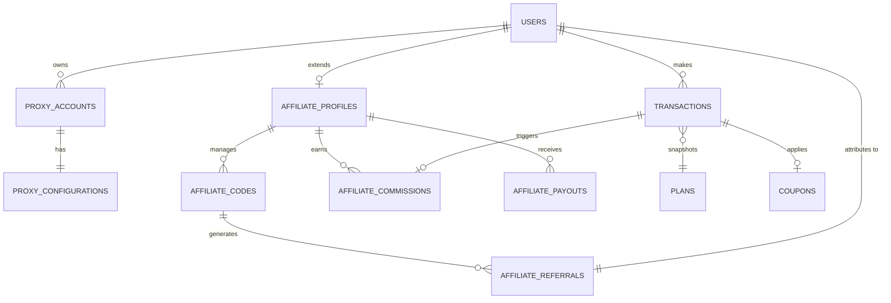

# ProxyData — Database Architecture & Schema Design

## 1. Database Goals

The database for ProxyData is designed to be:

- **Secure**: Sensitive data (provider secrets, passwords) are omitted from client-facing collections.
- **Scalable & Fast**: Uses targeted indexing and materialized dashboard aggregates rather than heavy on-the-fly map-reduces.
- **Provider-Agnostic**: Core models refer to a generic `providerId` and `proxyType`, allowing drop-in of future providers alongside DataImpulse.
- **Safe for Finances**: Uses atomic operations (`findOneAndUpdate` with concurrency guards) to prevent double-redemption, duplicate allocations, and lost bandwidth.
- **Maintainable**: Prefer embedding for tightly coupled data (e.g., plan snapshots inside transactions) and referencing for independent entities (users, sub-users).

## 2. Database Technology

**Selection: MongoDB Native Driver + Zod**

_Trade-off_:

- **Mongoose** provides built-in schema validation and population, but it is heavy, sometimes slow in serverless environments, and forces a specific ODM paradigm.
- **MongoDB Native Driver** with **Zod** (already selected for frontend forms) allows us to share TypeScript schemas between client forms and database validation. It is lightweight and highly performant in Next.js Server Actions.

_Recommendation_: Use the Native Driver with Zod schemas to validate documents before insertion. The design below is compatible with either approach.

## 3. Required Main Collections

We will use the following collections. Unnecessary collections have been merged.

1. `users` (Combined Better Auth + Business User data)
2. `sessions` & `accounts` (Better Auth requirements)
3. `providers` (Provider abstraction settings)
4. `proxy_accounts` (Maps user to DataImpulse sub-user)
5. `plans`
6. `transactions` (Unified ledger for purchases, redeems, administrative adjustments)
7. `redeem_codes`
8. `coupons`
9. `offers`
10. `coupon_usages`
11. `affiliate_profiles` (Extends user with affiliate data)
12. `affiliate_codes`
13. `affiliate_referrals` (First-touch mapping)
14. `affiliate_commissions`
15. `affiliate_payouts`
16. `proxy_configurations` (Latest saved config per proxy account — 1:1 with proxy_accounts)
17. `provider_metadata` (Cached `locations` + `pool_stats`)
18. `provider_operation_logs` (Audit/reconciliation log for dangerous API operations)
19. `notifications`
20. `audit_logs`
21. `system_settings`

_Merged/Omitted_:

- `entitlements` is merged into `proxy_accounts`. Since DataImpulse requires a distinct sub-user for every proxy type (Residential vs Mobile) and is the absolute authority on "Remaining GB", tracking a separate internal `entitlement` document risks drifting out of sync. The `proxy_account` itself IS the entitlement.
- `provider_accounts` (Reseller account balance) is omitted as a persistent collection. The global DataImpulse balance is constantly changing. It should be fetched dynamically via API or cached in memory/Redis.

## 4. Users Collection

Better Auth requires a `user` table. We will extend it with our business fields.

**Fields**:

- `_id` (ObjectId)
- `publicUserId` (String, unique, e.g. "PX-849201")
- `name` (String)
- `email` (String, unique)
- `emailVerified` (Boolean - Better Auth)
- `image` (String - Better Auth)
- `role` (String: `ROLE_ADMIN` | `ROLE_USER`)
- `capabilities` (Array of Strings: e.g., `["CAPABILITY_AFFILIATE"]`)
- `status` (String: `ACTIVE`, `SUSPENDED`, `DEACTIVATED`)
- `createdAt`, `updatedAt` (Dates)

_Note_: Passwords are not stored here. Better Auth manages credentials in a separate plugin/collection if using email/password, or relies on OAuth.

## 5. Better Auth Database Requirements

Better Auth strictly requires:

- `users`: Core identity (extended above).
- `accounts`: Maps OAuth providers (Google) to the user.
- `sessions`: Active login sessions.
- `verification_tokens`: For email verification/password resets.

We will use Better Auth's standard collections for these, keeping authentication decoupled from business data.

## 6. Public User ID

- **Format**: `PX-` followed by 6-8 alphanumeric characters (e.g., `PX-A7B9K2`).
- **Generation**: Cryptographically random (using a collision-resistant alphabet like Crockford Base32 to avoid I/l/1/0/O confusion).
- **Index**: Unique index on `publicUserId`.
- **Collision Handling**: Generator loops with a uniqueness check, retrying if a collision occurs (statistically near-zero chance).

## 7. Provider Collection

Abstracts the upstream proxy provider (e.g., DataImpulse).

- `_id` / `providerId` (String, e.g., "dataimpulse")
- `name` (String, e.g., "DataImpulse")
- `status` (String: `ACTIVE`, `MAINTENANCE`, `DISABLED`)
- `capabilities` (Array: e.g., `["residential", "mobile", "datacenter", "premium_residential"]`)
- `costPerGbBdt` (Map per pool, e.g., `{ residential: 90, mobile: 180, datacenter: 45, premium_residential: 450 }` — manual wholesale basis; feeds §01-10.2 formula)
- `lastSyncAt` (Date)

_Security_: API keys/tokens are NOT stored here. They reside in `.env`.

## 8. Provider Account / Reseller Account

- **Authoritative Data**: The Reseller Balance (GB) is fetched live via `GET /reseller/user/balance`.
- **Internal Business Data**: Wholesale cost basis is stored in `system_settings` or `provider` documents (e.g., `costPerGbBdt: 45`).
- **Storage**: We do not store the live balance in the database long-term; it's a dynamic metric.

## 9. Provider Sub-User Mapping (`proxy_accounts`)

**Important Domain Separation**:

- **proxy_accounts**: Persistent mapping to a DataImpulse sub-user/proxy pool account.
- **transactions**: Each individual purchase, redeem, or adjustment event.
- **provider balance**: Current DataImpulse-authoritative remaining balance.

**One Proxy Account per Provider + User + Proxy Type**:
The database supports exactly one persistent proxy account per distinct proxy type for a user.

- **Mapping**: `1 ProxyData User` + `1 Provider (DataImpulse)` + `1 Proxy Type (e.g. Residential)` = `1 proxy_account`.
- **Bandwidth Addition Rule**: If a user buys "Residential" again, DO NOT create another proxy account. Instead:
  1. Reuse the existing Residential `proxy_account`.
  2. Call the provider's `balance/add` mechanism.
  3. Create a new transaction representing the purchase.

**Fields**:

- `userId` (ObjectId)
- `providerId` (String, "dataimpulse")
- `providerSubUserId` (Int — DataImpulse integer `id`; stored as Number, never stringified)
- `proxyType` (String, 4-pool enum `RESIDENTIAL | MOBILE | DATACENTER | PREMIUM_RESIDENTIAL`)
- `poolTypeRaw` (String — verbatim upstream value incl. `residental` typo; mapping table in adapter)
- `login` (String, Proxy username)
- `password` (String, AES-256-GCM encrypted blob; key from server env/KMS, never logged, rotation via `reset-password`)
- `threads` (Number, default 100) + `stickyRange {start,end}` + `rotationInterval?` + `anonymousFilter?` (mirrors upstream; edit via `update`/`set-default-pool-parameters`)
- `status` (String: `ACTIVE`, `BLOCKED`)
- `cumulativePurchasedBytes` (Number) - _Cache for reporting only; ledger (`transactions`) is authoritative._
- `cachedRemainingBytes` (Number) + `cachedTotalBytes` + `cachedUsedBytes`
- `lastBalanceSyncAt` (Date) - _Snapshot only; stale cache is never authoritative. Refresh via TTL worker (default 5 min hot / 60 min cold), never per-request fanout._

**Unique Constraint**:

- `userId` + `providerId` + `proxyType` (Ensures one user gets only ONE sub-user per proxy type).
- `providerId` + `providerSubUserId` (Ensures no upstream account is mapped twice).

## 10. Proxy Types (LOCKED)

Stored as internal constants mapped to provider identifiers.

- Internal: `RESIDENTIAL`, `MOBILE`, `DATACENTER`, `PREMIUM_RESIDENTIAL`.
- DataImpulse values: `residential`, `mobile`, `datacenter`, `premium_residential` (confirm exact premium string in sandbox; tolerate `residental` typo on read).
- Pool coefficients: ×1.0 / ×2.0 / ×0.5 / ×5.0 respectively (see §01-10.2).
- Represented in DB as the internal constant to remain provider-agnostic.

## 11. Plans Collection

Dynamic catalog of packages.

- `planId` (ObjectId)
- `name` (String, "5 GB Residential")
- `providerId` (String, "dataimpulse")
- `proxyType` (String, 4-pool enum)
- `bandwidthGb` (Number, integer GB, 5)
- `retailPriceBdt` (Number, integer whole Taka, 500)
- `status` (`ACTIVE`, `INACTIVE`, `ARCHIVED` — `ARCHIVED` hides from catalog but preserves history refs)
- `validityDays?` + `expiryAction?` (`BLOCK` default | `BLOCK_AND_RECLAIM`) — enforced locally by worker
- `createdAt`, `updatedAt` (Dates)

## 12. Pricing / Price Snapshot

Price snapshots are embedded in `transactions` per §15 (frozen at submission, re-validated at approval): `{ basePriceBdt, offerDiscountBdt, couponDiscountBdt, finalDiscountAppliedBdt, discountSource, couponCode, finalAmountBdt, providerCostBdt, poolCoefficient, filterMultiplier, trafficAddedGb, balanceChargedGb }`. If a plan price changes from 500 to 600 BDT, old transactions retain `basePriceBdt: 500` and approvals in flight abort for re-confirm.

## 13. Entitlements Collection (Merged)

As noted in Section 3, `entitlements` are merged into `proxy_accounts`. The `proxy_accounts` collection tracks `cumulativePurchasedBytes`. The `Remaining` balance is the TTL-cached `cachedRemainingBytes` from `balance/get`.

## 14. Entitlement and Proxy-Type Isolation

To check if a user has access to Datacenter proxies:
`db.proxy_accounts.findOne({ userId: X, proxyType: 'DATACENTER', status: 'ACTIVE' })`
Index: `{ userId: 1, proxyType: 1, status: 1 }`.

## 15. Transactions Collection

The unified financial ledger.

- `transactionId` (String, unique, e.g., "TX-102938")
- `userId` (ObjectId)
- `type` (`PURCHASE`, `REDEEM`, `ADMIN_ADJUSTMENT`)
- `proxyAccountId` (ObjectId, reference to the persistent mapping)
- `providerId` / `proxyType` (`RESIDENTIAL | MOBILE | DATACENTER | PREMIUM_RESIDENTIAL`) / `bandwidthBytes` (integer; `bandwidthGb × 1073741824`)
- `planSnapshot`: `{ planId, name }`
- **Pricing Snapshot (LOCKED — frozen at submission, re-validated at approval)**:
  - `providerCostBdt` (Number — coefficient-adjusted per §01-10.2: `ceil(gb × poolCoeff × filterMult × wholesaleCostPerGb)`)
  - `trafficAddedGb` / `balanceChargedGb` (Numbers — from `addition-history`; ratio proves applied coefficient)
  - `poolCoefficient` / `filterMultiplier` (Numbers — pinned for audit)
  - `basePriceBdt` (Number, original plan price)
  - `offerDiscountBdt` (Number)
  - `couponDiscountBdt` (Number)
  - `finalDiscountAppliedBdt` (Number)
  - `discountSource` (`OFFER` or `COUPON` or `NONE`)
  - `couponCode` (if applicable)
  - `finalAmountBdt` (Number)
- `paymentReference` (String — normalized TrxID; sparse unique index; replay guard)
- `senderNumber` (String — normalized; admin cross-checks amount ↔ TrxID ↔ sender)
- `status` (`PENDING`, `APPROVED`, `ALLOCATING`, `PROVIDER_VERIFIED`, `ACTIVE`, `REJECTED`, `CANCELLED`, `EXPIRED`, `FAILED` — full machine §16; `CANCELLED` is user/admin pre-approval cancel)
- `timestamps`: `{ createdAt, approvedAt, activatedAt, expiredAt }`

## 16. Transaction State Machine (LOCKED — mirrors §01-16.2; all transitions atomic with status precondition)

- `PENDING` -> `APPROVED` (Admin verifies payment + price/stock/coupon re-validation, coupon atomic claim in same txn)
- `PENDING` -> `REJECTED` (Admin denies; reason required) | `CANCELLED` (user/admin pre-approval cancel) | `EXPIRED` (hourly cron, exactly 7d UTC)
- `APPROVED` -> `ALLOCATING` (worker, single-flight per transactionId, idempotency key set)
- `ALLOCATING` -> `PROVIDER_VERIFIED` (balance/get delta confirms) | `FAILED` (provider error/timeout)
- `PROVIDER_VERIFIED` -> `ACTIVE` (commission decision — incl. explicit ৳0 — inserted in same txn; `PURCHASE` only)
- `FAILED` -> `ALLOCATING` (admin retry; live-balance check precedes every resend)
- Stale-`ALLOCATING` (>30 min, no terminal op-log) and stale-`PROCESSING` (>15 min) sweepers reconcile via `addition-history` + live balance — never auto-`ACTIVE`.

## 17. Redeem Codes

- `code` (String, unique, uppercase Crockford Base32, **≥12 chars from `crypto.randomBytes`** — short codes forbidden here; entropy compensates value)
- `bandwidthBytes`, `providerId`, `proxyType` (4-pool enum), `planRef?`, `monetaryValuationBdt?`
- `status` (`GENERATED`, `ACTIVE`, `PROCESSING`, `PROVIDER_ALLOCATED`, `USED`, `EXPIRED`, `DISABLED` — LOCKED, mirrors §01-17)
- `validFrom?` (Date, optional — code redeemable only at/after this time; absent = immediately `ACTIVE` per §01-17)
- `validTo` (Date, default 30 days from generation)
- `createdAt` (Date — generation audit; pairs with `validTo` for the 30-day rule)
- `redeemedBy` (UserId)
- `redeemedAt` (Date)

**State Machine & Safety**:

- Flow: `GENERATED` → `ACTIVE` → `PROCESSING` → `PROVIDER_ALLOCATED` → `USED`. Early exits: `GENERATED`/`ACTIVE` → `EXPIRED` (cron past `validTo`) / `DISABLED` (admin revoke + reason). `GENERATED` is creation-instant; immediately-`ACTIVE` codes transition in the same write.
- **Never Deleted**: Used codes are marked `USED` and permanently remain in history. They are never physically deleted.
- **Claim + ledger atomicity**: `findOneAndUpdate({ code, status: 'ACTIVE' } → 'PROCESSING')` and the `transactions(type=REDEEM)` insert run in ONE MongoDB multi-document transaction — exactly one of N concurrent redeemers commits.
- **Provider Timeout Recovery**: `PROCESSING` older than 15 min is reconciled (check `addition-history` + live `balance/get`): proven allocation advances to `PROVIDER_ALLOCATED` → `USED`; otherwise reverts to `ACTIVE`. Partial-failure escalates to admin review with both rows linked.
- **Commission exclusion**: `REDEEM` transactions never insert `affiliate_commissions` (enforced by worker branch, covered by test).

## 18. Coupon & Offer Data Models

### Offers Collection (`offers`)

Explicit plan-level promotions configured by the Admin. Visible to all eligible users without a code.

- `offerId` (ObjectId)
- `planId` (ObjectId, reference to `plans`)
- `status` (`ACTIVE`, `INACTIVE`)
- `discountType` (`FIXED_AMOUNT`, `PERCENTAGE`)
- `discountValue` (Number)
- `promotionalPriceBdt` (Number, computed effective price)
- `validFrom` / `validTo` (Dates)

### Coupons Collection (`coupons`)

Require user entry.

- `code` (String, unique, uppercase)
- `status` (`ACTIVE`, `INACTIVE`)
- `type` (`FIXED_AMOUNT`, `PERCENTAGE`)
- `value` (Number)
- `maxDiscountAmount` (Number — cap for percentage math)
- `isOneTime` (Boolean) - claimed atomically at APPROVAL (see §01-15.3); flips to `INACTIVE` in the same transaction after first claim.
- `usageLimit` (Number, optional — guarded by `usageCount < usageLimit` in the same transaction)
- `usageCount` (Number, default 0 — `$inc`-only, never client-set)
- `planId` (ObjectId, optional targeting)
- `userId` (ObjectId, optional targeting)
- `validFrom` / `validTo` (Dates)

### Coupon Usages Collection (`coupon_usages`)

Dedicated collection for auditable historical usage. Append-only.

- `couponId` (ObjectId)
- `userId` (ObjectId)
- `transactionId` (ObjectId)
- `discountAppliedBdt` (Number)
- `createdAt` (Date)
- Unique: `(couponId, transactionId)` — the concurrency guard; double-claim of one transaction is impossible.

## 19. Coupon vs Offer Logic & Priority

**Best Discount Rule**:
The system must NEVER stack both discounts. Only ONE discount may be applied per purchase.
`Base Price` → `Find applicable Offer` → `Find applicable Coupon` → `Compare discount benefit` → `Select ONE (Greater discount wins)` → `Final Price`.
_(Tie-breaker: If equal, Offer wins)._

**Transaction Snapshot**:
The `transactions` collection stores:

- `basePriceBdt`
- `offerDiscountBdt`
- `couponDiscountBdt`
- `finalDiscountAppliedBdt`
- `discountSource` (`OFFER` or `COUPON` or `NONE`)
- `couponCode` (if source was coupon; null with `NONE`)

## 20. Affiliate Profile (`affiliate_profiles`)

- `userId` (ObjectId, unique reference)
- `status` (`ACTIVE`, `SUSPENDED`)
- `globalCommissionOverride` (Object, optional): Affiliate-level commission override that applies across all plans unless a more specific plan-level rule exists. Example: `{ commissionAmountBdt: 25, commissionBandwidthGb: 5 }`
- `commissionRules` (Array of Objects): Plan-specific commission overrides (highest priority). Example: `[{ planId: ObjectId, commissionAmountBdt: 30, commissionBandwidthGb: 5 }]`
- `createdAt`

## 21. Affiliate Codes (`affiliate_codes`)

- `code` (String, unique, uppercase, <= 8 chars)
- `affiliateId` (ObjectId)
- `status` (`ACTIVE`, `DISABLED`)
- `createdAt` (Date — required; enforces the 3-new-codes/day/affiliate throttle via `{ affiliateId: 1, createdAt: -1 }`)

## 22. Affiliate Referral Attribution (`affiliate_referrals`)

First-touch attribution.

- `referredUserId` (ObjectId, unique index)
- `affiliateId` (ObjectId)
- `codeUsed` (String)
- `createdAt` (Date)

## 23. Affiliate Commission (`affiliate_commissions`)

Contains a comprehensive historical snapshot guaranteeing that later plan/rule changes never alter historical commissions.

- `commissionId` (ObjectId)
- `affiliateId` (ObjectId)
- `referredUserId` (ObjectId)
- `transactionId` (ObjectId)
- `qualifyingBandwidthBytes` (Number)
- **Rule Snapshot**:
  - `commissionRuleAmountBdt` (Number, e.g., 30)
  - `commissionRuleBandwidthGb` (Number, e.g., 5)
- **Financial Snapshot**:
  - `originalPlanPriceBdt` (Number)
  - `providerCostBdt` (Number)
  - `offerDiscountBdt` (Number)
  - `couponDiscountBdt` (Number)
  - `finalCustomerPriceBdt` (Number)
  - `ownerMinimumProfitFloorBdt` (Number)
- **Calculation Outputs**:
  - `actualOwnerMarginBdt` (Number)
  - `calculatedNormalCommissionBdt` (Number)
  - `maximumSafeCommissionBdt` (Number)
  - `finalCommissionBdt` (Number)
- **Ledger State**:
  - `accountingPeriod` (String `YYYY-MM` Asia/Dhaka + UTC range — see §25)
  - `status` (`UNPAID`, `PARTIALLY_PAID`, `PAID`)
  - `paidAmountBdt` (Number)
- `createdAt` (Date)

### Commission Calculation Examples

Affiliate commission must NEVER reduce the Owner's profit below the configured minimum profit floor. The final commission is `MAX(0, MIN(Normal Calculated, Maximum Safe))`.

#### Normal Sale

```text
Provider Cost = ৳650
Customer Price = ৳700
Normal Commission = ৳30
Minimum Profit = ৳15

Margin = ৳50
Safe Commission = ৳35
Final Commission = ৳30 (Normal is fully paid)
```

#### Discounted Sale

```text
Provider Cost = ৳650
Customer Price = ৳680
Normal Commission = ৳30
Minimum Profit = ৳15

Margin = ৳30
Safe Commission = ৳15
Final Commission = ৳15 (Capped to preserve profit floor)
```

#### No Safe Commission

```text
Provider Cost = ৳650
Customer Price = ৳660
Minimum Profit = ৳15

Margin = ৳10
Safe Commission = negative (-৳5)
Final Commission = ৳0 (No commission generated)
```

## 24. Affiliate Payouts (`affiliate_payouts`)

Manual ledger supporting full, partial, calendar-month, and ad-hoc settlements.

- `payoutId` (ObjectId)
- `affiliateId` (ObjectId)
- `accountingPeriod` (String `YYYY-MM` Asia/Dhaka; ad-hoc mid-month settlements use `accountingPeriod: "CUSTOM"` + required `customRange: { startUtc, endUtc }`)
- `amountBdt` (Number)
- `reference` (String — required, e.g. bKash TrxID)
- `receiptUrl` (String, optional — object-storage URL of uploaded receipt/screenshot; image only, ≤5 MB)
- `createdAt` (Date)

## 25. Affiliate Accounting Period

Format: `YYYY-MM` (e.g., `2026-09`) in **Asia/Dhaka**, stored with its UTC range pair. Derived from transaction `activatedAt` (not submission).

## 26. Proxy Configuration (`proxy_configurations`)

**Constraint**: One configuration document per proxy account (`proxyAccountId` must be unique — 1:1 with `proxy_accounts`).

- `userId` (ObjectId)
- `proxyAccountId` (ObjectId, reference to `proxy_accounts`, **unique index**)
- `protocol` (`http`, `socks5` — subset of upstream `supported-protocols/get`)
- `mode` (`rotating` | `sticky`) + `stickyPort?` (10000–20000)
- `country` (String) + `state?`/`city?`/`zip?`/`asnInclude?` (2x-billing filters; country required first) + `excludeAsn?` (1x)
- `threads?`, `rotationInterval?`, `anonymousFilter?`
- `whitelistedIps` (Array of Strings, max 5 per sub-user — **globally unique per IP across ALL sub-users**; enforced by move-semantics in app + upstream error mapping; IPv4/IPv6 validated, private/loopback rejected)
- `consentForSupportView?` (Boolean — gates admin visibility of usage detail/errors)
- `updatedAt` (Date)

_Security_: Password is NOT stored here. It's stored encrypted in `proxy_accounts`. Password is masked by default in output; reveal-once audited.

## 27. Provider Metadata (`provider_metadata`)

Cached from `/reseller/common/locations` + `/reseller/common/pool_stats` (hourly single-leader cron; **upsert by `(providerId, poolType, countryCode)` — never full overwrite**).

- `providerId` ("dataimpulse")
- `poolType` (`"datacenter"`, `"residential"`, `"mobile"`, `"premium_residential"`)
- `countryCode` (String)
- `countryName` (String)
- `count` (Number — from `pool_stats`; absent `locations`-only rows store `count: null`)
- `syncedAt` (Date)

## 28. Provider Synchronization (`provider_sync_logs`)

- `providerId`
- `syncType` ("LOCATIONS", "POOL_STATS")
- `status` (`SUCCESS`, `FAILED`)
- `completedAt` (Date)

## 29. Notifications

- `userId` (ObjectId)
- `type` (enum: `PURCHASE_RECEIVED`, `PURCHASE_APPROVED`, `PROXY_ACTIVATED`, `PURCHASE_REJECTED`, `PURCHASE_CANCELLED`, `PURCHASE_EXPIRED`, `REDEEM_SUCCESS`, `ACCOUNT_SUSPENDED`, `ACCOUNT_RESTORED`, `AFFILIATE_REFERRAL`, `AFFILIATE_PAYOUT` — mirrors §01-22.1; Zod-enforced, no free strings)
- `title`, `message` (Strings — no secrets; proxy passwords/TrxID-full forbidden)
- `read` (Boolean)
- `createdAt` (Date; 90-day TTL per §46)

## 30. Audit Logs

- `actorId` (ObjectId)
- `actorRole` (String)
- `action` (String, e.g., "SUSPEND_USER", "APPROVE_PURCHASE")
- `targetType` (String, e.g., "USER", "TRANSACTION")
- `targetId` (ObjectId)
- `metadata` (Object — REDACTED per §01-24.1 rule 6: no passwords, tokens, TrxID-full, or reset tokens)
- `ipAddress` (String — originating client IP)
- `createdAt` (Date)

## 31. System Settings

Singleton document.

- `_id` ("GLOBAL_SETTINGS")
- `pendingRequestExpiryDays` (Number, default 7)
- `affiliateMaxActiveCodes` (Number, default 5)
- `defaultCommissionPerGbBdt` (Number, default 10) — the global fallback commission rate
- `minimumOwnerProfitBdt` (Number, default 15) — the owner profit floor for commission capping

> **Security Note — ADMIN_PATH**: The obscured admin portal path (e.g., `/axiomshuvo`) is stored **exclusively** as a server-side environment variable (`ADMIN_PATH`). It is **never** stored in `system_settings` or any database collection. It must **never** be prefixed with `NEXT_PUBLIC_`. The Next.js 16 `proxy.ts` reads this value server-side to dynamically protect and route the admin area.

## 32. Indexing Strategy

- **`users`**: `{ publicUserId: 1 }` (Unique), `{ email: 1 }` (Unique).
- **`proxy_accounts`**: `{ userId: 1, providerId: 1, proxyType: 1 }` (Unique — one sub-user per type), `{ providerId: 1, providerSubUserId: 1 }` (Unique).
- **`proxy_configurations`**: `{ proxyAccountId: 1 }` (Unique — enforces 1:1 with proxy_accounts).
- **`transactions`**: `{ transactionId: 1 }` (Unique), `{ userId: 1, createdAt: -1 }`, `{ status: 1, createdAt: 1 }` (expiry + sweeper crons), `{ paymentReference: 1 }` (Unique, sparse — replay guard).
- **`redeem_codes`**: `{ code: 1 }` (Unique), `{ status: 1, validTo: 1 }` (expiry cron), `{ redeemedBy: 1, code: 1 }` (Unique, partial — idempotency).
- **`coupons`**: `{ code: 1 }` (Unique, case-insensitive collation `strength: 2`).
- **`coupon_usages`**: `{ couponId: 1, transactionId: 1 }` (Unique — claim guard), `{ couponId: 1, userId: 1 }`.
- **`affiliate_codes`**: `{ code: 1 }` (Unique, case-insensitive collation `strength: 2`), `{ affiliateId: 1, status: 1 }` (limit check), `{ affiliateId: 1, createdAt: -1 }` (creation throttle).
- **`affiliate_referrals`**: `{ referredUserId: 1 }` (Unique — first-touch), `{ affiliateId: 1 }`.
- **`affiliate_commissions`**: `{ transactionId: 1 }` (Unique — one decision per purchase), `{ affiliateId: 1, status: 1 }`, `{ affiliateId: 1, accountingPeriod: 1 }`, `{ referredUserId: 1 }`, `{ createdAt: -1 }`.
- **`provider_operation_logs`**: `{ transactionId: 1, operationType: 1 }` (Unique — idempotent retry), `{ status: 1, createdAt: 1 }` (sweeper).
- **`provider_metadata`**: `{ providerId: 1, poolType: 1, countryCode: 1 }` (Unique — upsert key).
- **`usage_snapshots`** (optional, if persisted): `{ proxyAccountId: 1, date: 1 }` + TTL 30d. Raw `usage-stat/detail` is NEVER persisted beyond 30 days.

## 33. Unique Constraints

- **User Email**: Unique
- **Public User ID**: Unique
- **Provider Sub-User ID**: Unique per provider (`providerId + providerSubUserId`).
- **Redeem / Affiliate / Coupon Codes**: Unique globally (affiliate + coupon case-insensitive).
- **Referral Attribution**: Unique on `referredUserId` (First-touch at registration only).
- **Commission Decision**: Unique on `transactionId` (exactly one decision, incl. ৳0, per purchase).
- **Payment Reference**: Unique sparse on `paymentReference` (TrxID replay guard).
- **Idempotency**: Unique on `provider_operation_logs(transactionId, operationType)`.

## 34. Soft Deletion

- **Users**: Status becomes `DEACTIVATED`. Personal data obfuscated.
- **Affiliate Codes**: Status becomes `DISABLED`.
- **Plans / Coupons**: Status becomes `INACTIVE`.
- **Transactions / Ledgers**: NO DELETION ALLOWED.

## 35. Data Integrity Rules

- **No Negative Bandwidth from clients**: Zod `min(1)` GB on all client inputs. Negative adjustments exist ONLY server-side (expiry/clawback) with dedicated audit rows.
- **No Duplicate Sub-Users**: Database unique index on `userId + providerId + proxyType`; creation uses upsert-with-filter so concurrent same-type purchases yield one account + N transactions.
- **No Payout > Unpaid Balance**: payout insert runs in a transaction that re-sums `UNPAID` commissions with a status guard; concurrent payouts serialize on the affiliate's ledger key.
- **No Self-Commission**: commission insert aborts when `affiliateId == referredUserId`.
- **No Commission Without Activation**: commission insert requires parent transaction `status == ACTIVE` (same txn).

## 36. Atomic Operations (LOCKED)

- **Redeem claim**: `findOneAndUpdate({ code, status: 'ACTIVE' }, { $set: { status: 'PROCESSING', redeemedBy, updatedAt } })` + `transactions` insert in ONE multi-document transaction.
- **Purchase Approval**: `findOneAndUpdate({ _id, status: 'PENDING' } → 'APPROVED')` + coupon claim (`coupon_usages` insert + `usageCount` guard) + price-snapshot freeze in ONE transaction; worker then flips `APPROVED → ALLOCATING` single-flight before the first provider call.
- **Allocation confirm**: `ALLOCATING → PROVIDER_VERIFIED → ACTIVE` + commission insert (`affiliate_commissions`, unique per transactionId) in ONE transaction after `balance/get` proof.
- **Affiliate code create**: count-check + insert in ONE transaction (limit race impossible).
- **Entitlement Generation**: `updateOne` with upsert + unique `(userId, providerId, proxyType)` — concurrent first-purchases converge on one `proxy_account`.

## 37. Idempotency (LOCKED)

- DataImpulse's `balance/add` is NOT idempotent. Every provider call is preceded by a `provider_operation_logs` row `{ transactionId, operationType, payload, status: PENDING }` (unique key) and followed by terminal `SUCCESS | TIMEOUT | FAILED`.
- Retry rule: before ANY resend, read live `balance/get` + `addition-history` and compare against pre-call snapshot; if the delta already reflects the request, mark `SUCCESS` from evidence and advance WITHOUT resending.
- Stale `PENDING` op-logs (>30 min) are reconciled by the sweeper, never blindly retried.

## 38. Source of Truth Matrix

| Field                | Source of Truth                                  |
| :------------------- | :----------------------------------------------- |
| Plan price           | ProxyData (`plans`)                              |
| Offer configuration  | ProxyData (`offers`)                             |
| Coupon configuration | ProxyData (`coupons`)                            |
| Purchase history     | ProxyData (`transactions` ledger)                |
| Provider sub-user    | DataImpulse + ProxyData `proxy_accounts` mapping |
| Remaining GB         | DataImpulse (`/balance/get`)                     |
| Commission           | ProxyData (`affiliate_commissions`)              |
| Payout               | ProxyData (`affiliate_payouts`)                  |

## 39. Provider Data vs Internal Data

- **Provider**: `providerSubUserId`, Remaining GB, Locations.
- **Internal**: `publicUserId`, Retail Price, Total Purchased GB.
- **Derived**: Total Revenue, Unpaid Commission (derived via MongoDB aggregates on `transactions` and `affiliate_commissions`).

## 40. Financial Precision (LOCKED)

- **Storage**: integer BDT, whole Taka. Percentage math rounds the customer `finalAmountBdt` half-up; commission normal-value rounds DOWN (floor) — always owner-favoring. Both roundings pinned in §01-12.4/14.1 and covered by acceptance tests. (Paisa sub-units deferred by explicit decision — BDT retail never prices fractional Taka; revisit via ADR if a gateway requires paisa.)

## 41. Bandwidth Precision (LOCKED)

Pipeline: `API request (integer GB)` → `× 1073741824` → `Internal Bytes (integer)` → `UI Display (GB, 2dp)`.

- **Storage**: all bandwidth math and ledger history in **bytes (integer)** — no floats.
- **Adapter edge**: `allocateBandwidth({ trafficGb })` validates integer `1..1000`; `balance/get` byte fields map to `cachedRemainingBytes/cachedTotalBytes/cachedUsedBytes`.
- Sandbox confirmation (§02-§9 item 1) still required pre-launch, but the default is locked — no per-call branching.

## 42. Historical Snapshots

Embedded in `transactions` (LOCKED shape — matches §15):

```json
{
  "planSnapshot": { "planId": "64f1d5...", "name": "5 GB Residential", "basePriceBdt": 500 },
  "pricing": {
    "offerDiscountBdt": 20, "couponDiscountBdt": 0, "finalDiscountAppliedBdt": 20,
    "discountSource": "OFFER", "couponCode": null, "finalAmountBdt": 480,
    "providerCostBdt": 320, "poolCoefficient": 1.0, "filterMultiplier": 1.0,
    "trafficAddedGb": 5, "balanceChargedGb": 5
  }
}
```

## 43. Security-Sensitive Fields (LOCKED)

- **DataImpulse Token**: server env only (never DB, never `NEXT_PUBLIC_`). Cached with decoded `exp`, single-flight refresh (§02-§1).
- **Sub-User Proxy Passwords**: AES-256-GCM encrypted at rest in `proxy_accounts.password` (key in server env/KMS with rotation procedure). Decrypted server-side ONLY for the owning authenticated user; masked by default, reveal-once audited. Rotation via `reset-password` (§02-§3).
- **Strict Controls**: no password/token/TrxID-full in logs, audit `changes`/`metadata`, error responses, or PWA caches. `sub-user/list` responses are server-only and redacted before any persistence.
- **Better Auth Sessions**: DB-backed cookie sessions; suspension/deactivation deletes rows + expires cookies (§01-§9.3).
- **Gateway Config**: `DATAIMPULSE_GATEWAY_HOST=gw.dataimpulse.com`, rotating `823/824`, sticky `10000–20000` — server env, startup health-checked (§01-§27).

## 44. Query Patterns

- **Customer Dashboard**: `proxy_accounts` by `userId` (from TTL cache fields; refresh worker, never live fanout) + recent `transactions` by `{ userId, createdAt: -1 }`.
- **Admin Dashboard**: on-the-fly aggregates under 100k txns (`sum(finalAmountBdt)` where `status: ACTIVE`); above that, nightly `daily_stats` materialization (§45). Stock from `user/balance` + `pool_stats` cache.
- **Cron Expiry (hourly, UTC)**: atomic per-doc claim — `findOneAndUpdate({ status: 'PENDING', createdAt: { $lt: now - 7d } } → 'EXPIRED')` in batches (never blind `updateMany` that could race an in-flight approval; approvals hold the same status precondition so only one wins).
- **Sweepers**: stale `ALLOCATING` (>30 min) and `PROCESSING` (>15 min) reconciled via op-log + live balance before any state move.

## 45. Dashboard Aggregation Strategy

- Run on-the-fly aggregations for low-volume phases.
- If transactions exceed 100k, implement a nightly materialized view script that sums daily revenue into a `daily_stats` collection.

## 46. Retention & Historical Data (LOCKED)

- `transactions`, `audit_logs`, `affiliate_commissions`, `affiliate_payouts`, `coupon_usages`, `provider_operation_logs`: retained indefinitely (legal/audit spine; no TTL).
- `provider_metadata`: upserted hourly, never wiped (`syncedAt` per row; failed sync keeps last good).
- `notifications`: 90-day TTL (in-app only; email receipts are the durable record).
- `usage_snapshots`/raw `usage-stat/detail`: 30-day TTL (privacy). Aggregated chart rollups may persist as anonymous counts.

## 47. Final Collection Relationship Diagram



## 48. Collection-by-Collection Specification

_(Abridged for core business logic)_

### Collection: `proxy_accounts`

**Purpose**: Maps a user to a DataImpulse sub-user for a specific proxy type.

| Field               | Type     | Required | Unique | Indexed | Description         |
| ------------------- | -------- | -------: | -----: | ------: | ------------------- |
| `_id`               | ObjectId |      Yes |    Yes |     Yes | Internal ID         |
| `userId`            | ObjectId |      Yes |     No |     Yes | Ref to User         |
| `providerId`        | String   |      Yes |     No |      No | "dataimpulse"       |
| `providerSubUserId` | Number   |      Yes |    Yes |     Yes | Upstream integer id |
| `proxyType`         | String   |      Yes |     No |     Yes | 4-pool enum         |
| `poolTypeRaw`       | String   |      Yes |     No |      No | Verbatim upstream   |
| `login`             | String   |      Yes |     No |      No | Proxy username      |
| `password`          | String   |      Yes |     No |      No | AES-256-GCM blob    |
| `cumulativePurchasedBytes` | Number |  Yes |     No |      No | Reporting cache     |
| `cachedRemainingBytes` | Number |   Yes |     No |      No | TTL snapshot        |
| `status`            | String   |      Yes |     No |     Yes | ACTIVE/BLOCKED      |

**Integrity Rule**: `userId` + `providerId` + `proxyType` must be unique.

### Collection: `transactions`

**Purpose**: Immutable financial ledger.

| Field                     | Type     | Required | Unique | Indexed | Description                     |
| ------------------------- | -------- | -------: | -----: | ------: | ------------------------------- |
| `transactionId`           | String   |      Yes |    Yes |     Yes | Public TX ID                    |
| `userId`                  | ObjectId |      Yes |     No |     Yes | Ref to User                     |
| `type`                    | String   |      Yes |     No |      No | PURCHASE, REDEEM, ADMIN_ADJUSTMENT  |
| `planSnapshot`            | Object   |      Yes |     No |      No | `{planId, name, basePriceBdt}` |
| `providerCostBdt`         | Number   |      Yes |     No |      No | Coefficient-adjusted cost |
| `poolCoefficient`         | Number   |      Yes |     No |      No | Pinned pool coeff       |
| `filterMultiplier`        | Number   |      Yes |     No |      No | Pinned 1x/2x            |
| `trafficAddedGb`          | Number   |      Yes |     No |      No | From addition-history   |
| `balanceChargedGb`        | Number   |      Yes |     No |      No | From addition-history   |
| `basePriceBdt`            | Number   |      Yes |     No |      No | Plan retail price before discnt |
| `offerDiscountBdt`        | Number   |      Yes |     No |      No | Discount from active Offer      |
| `couponDiscountBdt`       | Number   |      Yes |     No |      No | Discount from applied Coupon    |
| `finalDiscountAppliedBdt` | Number   |      Yes |     No |      No | The ONE discount actually used  |
| `discountSource`          | String   |      Yes |     No |      No | `OFFER`, `COUPON`, or `NONE`    |
| `couponCode`              | String   |       No |     No |      No | Code used (if source=COUPON)    |
| `finalAmountBdt`          | Number   |      Yes |     No |      No | BDT customer actually paid      |
| `paymentReference`        | String   |       No |    Yes |     Yes | TrxID, sparse unique (replay guard) |
| `senderNumber`            | String   |       No |     No |     Yes | Normalized sender MSISDN        |
| `status`                  | String   |      Yes |     No |     Yes | Lifecycle state                 |

## 49. Schema Examples

**proxy_accounts Example:**

```json
{
  "_id": "64f1a2...",
  "userId": "64f1b3...",
  "providerId": "dataimpulse",
  "providerSubUserId": 4050,
  "proxyType": "RESIDENTIAL",
  "poolTypeRaw": "residental",
  "login": "82364cb158467f5e5a64",
  "password": "U2FsdGVkX19xN...<AES-256-GCM_blob>...",
  "threads": 100,
  "stickyRange": { "start": 11000, "end": 20000 },
  "cumulativePurchasedBytes": 5368709120,
  "cachedRemainingBytes": 2147483648,
  "lastBalanceSyncAt": "2026-09-16T10:05:00Z",
  "status": "ACTIVE",
  "createdAt": "2026-09-15T08:30:28Z"
}
```

**transactions Example:**

```json
{
  "_id": "64f1c4...",
  "transactionId": "TX-9018247",
  "userId": "64f1b3...",
  "type": "PURCHASE",
  "providerId": "dataimpulse",
  "proxyType": "RESIDENTIAL",
  "bandwidthBytes": 5368709120,
  "planSnapshot": {
    "planId": "64f1d5...",
    "name": "5 GB Residential",
    "basePriceBdt": 500
  },
  "pricing": {
    "offerDiscountBdt": 0, "couponDiscountBdt": 50, "finalDiscountAppliedBdt": 50,
    "discountSource": "COUPON", "couponCode": "WELCOME10", "finalAmountBdt": 450,
    "providerCostBdt": 320, "poolCoefficient": 1.0, "filterMultiplier": 1.0,
    "trafficAddedGb": 5, "balanceChargedGb": 5
  },
  "paymentReference": "BHX8K2Q9PA",
  "senderNumber": "88017XXXXXXXX",
  "status": "ACTIVE",
  "createdAt": "2026-09-16T10:00:00Z"
}
```

## 50. Final Database Decisions

### Confirmed Decisions (LOCKED 2026-09-17)

1. **Entitlements = Proxy Accounts**: one row per `(userId, providerId, proxyType)` across 4 pools; concurrent first-purchases converge via upsert.
2. **Byte-Level Precision**: bytes integers in ledger; GB integers at the provider edge (`×1073741824`); GB 2dp at display.
3. **Reseller balance**: live `user/balance` + cached `pool_stats`; TTL-read in app, never N+1 fanout.
4. **Technology Stack**: Native MongoDB Driver + Zod (no Mongoose).
5. **Money**: integer whole-Taka BDT; final-price half-up, commission floor (§01-12.4/14.1).
6. **Costing**: coefficient-adjusted + 2x filter multiplier, both values pinned per transaction.
7. **Retention**: ledger/audit indefinite; notifications 90d; usage detail 30d TTL.

### Pending Decisions

Pre-launch sandbox confirmations only (§02-§9): exact `pool_type` create strings, fractional-traffic handling, real token TTL, 429 thresholds, delete balance fate.

### Risks & Recommended Safeguards

- **Risk**: `balance/add` is not idempotent.
- **Safeguard (LOCKED)**: op-log row first (unique key), pre-call balance snapshot, evidence-based retry (reconcile via `balance/get` + `addition-history` before every resend), stale-`PENDING` sweeper. See §36–§37, §51.

### Database Implementation Notes

- All order/redeem/coupon state transitions use atomic status-precondition writes inside multi-document transactions where a ledger row is co-written — never bare `$set`.
- Passwords from `sub-user/create|list|reset-password` are AES-256-GCM encrypted before ANY write, redacted in all logs, decrypted server-side only for the owning user.

## 51. `provider_operation_logs`

**Purpose**: Reconciliation and audit log for dangerous provider API operations (e.g., `balance/add`, `create sub-user`). Ensures that if a network timeout occurs after calling `balance/add`, the system has enough durable information to reconcile the uncertain state before retrying.

| Field           | Type     | Required | Description                                                    |
| --------------- | -------- | -------: | -------------------------------------------------------------- |
| `_id`           | ObjectId |      Yes | Internal ID                                                    |
| `transactionId` | ObjectId |      Yes | Reference to the triggering transaction (unique with op type)  |
| `operationType` | String   |      Yes | `ADD_BALANCE`, `CREATE_USER`, `DROP_BALANCE`, `SET_BLOCKED`, `DELETE_USER`, `RESET_PASSWORD` |
| `provider`      | String   |      Yes | `DataImpulse`                                                  |
| `payload`       | Object   |      Yes | Exact payload sent (REDACTED — no passwords/tokens/TrxID-full) |
| `preCallBalanceBytes` | Number |  Yes | Snapshot before send (retry evidence)                         |
| `response`      | Object   |       No | Upstream reply (redacted)                                      |
| `status`        | String   |      Yes | `PENDING`, `SUCCESS`, `TIMEOUT`, `FAILED`                      |
| `createdAt`     | Date     |      Yes |                                                                |
| `updatedAt`     | Date     |      Yes |                                                                |

**Idempotency use (LOCKED)**: unique `(transactionId, operationType)`. Before retrying a timed-out `balance/add`, read live `balance/get` + `addition-history` vs `preCallBalanceBytes`; if the delta proves the allocation, mark `SUCCESS` from evidence and advance WITHOUT resending. Stale `PENDING` (>30 min) is reconciled by the sweeper, never blindly retried.

## 52. Infrastructure Constraints (Free Tier Mode)

To safely operate within the MongoDB Atlas M0 Free Tier limits (500 connections, 100 ops/sec, 512 MB storage), the backend MUST implement the following safeguards:

1. **Connection Pooling**: The MongoDB client initialization must enforce a strict `maxPoolSize: 10`. Because the app runs on a persistent Node.js server (Hostinger Web App), this guarantees connection exhaustion will never occur.
2. **Aggressive Read Caching**: To prevent breaching the 100 ops/sec limit during traffic spikes, high-traffic read operations (e.g., fetching `plans` and `provider_metadata` for the homepage/checkout) must be cached in memory (Next.js Data Cache / unstable_cache) with a minimum 15-minute revalidation window. 
3. **Storage Monitoring**: The database consists purely of text/JSON. 512 MB is sufficient for ~250,000+ transactions. A storage monitor must be exposed to the Admin UI to track consumption.
